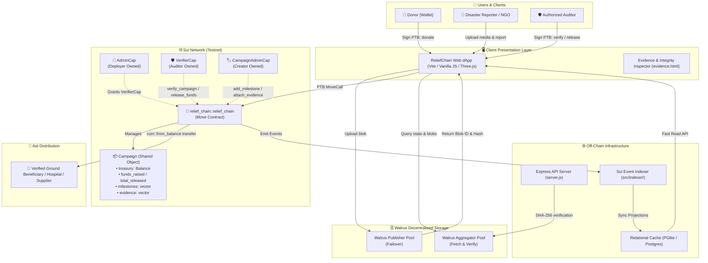

# 🌍 RELIEFCHAIN

<div align="center">

> **Transparent. Verifiable. Decentralized disaster relief powered by Sui.**

[](https://suiscan.xyz/testnet/object/0x9c0e1fe411f3f1bc9b877710d000ef4ca3113e3461cdffed469be1f1bd7b5bfe)
[](https://walrus.space)
[](https://github.com/Riju79/relief-chain/tree/main/move)
[](LICENSE)
[](#-testing)

<p align="center">
  <b>ReliefChain</b> is a decentralized humanitarian aid and disaster-relief protocol engineered on the <b>Sui Blockchain</b> and <b>Walrus Decentralized Storage Network</b>. It replaces traditional, opaque donation pipelines with immutable smart contract treasuries, cryptographic evidence anchoring, and milestone-governed fund disbursements.
</p>

[🌐 Live Web3 App](https://relief-chain-cyan.vercel.app/) •
[🎥 Video Demonstration](https://youtu.be/zmKse7QxKLk?si=Nv8RRjgtxEU4_33P) •
[🔍 SuiScan Contract](https://suiscan.xyz/testnet/object/0x9c0e1fe411f3f1bc9b877710d000ef4ca3113e3461cdffed469be1f1bd7b5bfe) •
[📜 Documentation](docs/audit/CAPABILITY_MAP_AND_CUSTODY.md) •
[💻 GitHub Repository](https://github.com/Riju79/relief-chain)

</div>

---

## ✨ What is ReliefChain?

### The Crisis in Humanitarian Aid
Traditional disaster relief suffers from systemic inefficiencies and trust deficits:
* **Opaque Fund Intermediaries:** Up to 30–40% of international disaster relief capital is consumed by administrative overhead, cross-border banking fees, and unaccountable middlemen.
* **Donor Uncertainty:** Donors have no cryptographic guarantee that their contributions reach the intended ground victims or vetted relief workers.
* **Vulnerable & Centralized Evidence:** Disaster documentation (damage assessments, vendor receipts, delivery manifests) is frequently stored in editable centralized spreadsheets or private servers vulnerable to manipulation and loss.
* **Creator Custody Risk:** Conventional crowdfunding platforms deposit donated capital directly into the personal bank accounts of campaign creators before any proof of relief execution is delivered.

### The ReliefChain Solution
ReliefChain addresses each structural vulnerability through programmable Web3 infrastructure:
* **Programmable On-Chain Treasuries:** Donations are locked into native Move shared objects (`Campaign`) holding `Balance<SUI>`. No single entity—not even the campaign creator—can withdraw funds arbitrarily.
* **Decentralized Cryptographic Evidence:** Field assessments, satellite imagery, and proof-of-delivery documents are published directly to **Walrus**. The immutable Walrus Blob ID and its SHA-256 content hash are anchored on Sui.
* **Capability-Governed Milestone Releases:** Treasury capital is released in tranches only after authorized verifiers holding non-forgeable Sui capabilities (`VerifierCap`) confirm milestone execution on-chain.
* **Direct Beneficiary Routing:** Smart contract payouts bypass campaign creators entirely and transfer directly to the verified on-the-ground beneficiary's address.
* **Real-Time Auditability:** Every donation, campaign milestone, and evidence attachment emits transparent Sui on-chain events indexed for independent public verification.

---

## 🧠 Core Idea

> **Money lives on Sui. Evidence lives on Walrus. Verification happens through authorized on-chain logic.**

```
   ┌────────────────────────┐         ┌────────────────────────┐
   │     Sui Blockchain     │         │ Walrus Storage Network │
   │  (Financial Truth &    │         │ (Decentralized Bulk    │
   │      Governance)       │         │      Evidence)         │
   └───────────┬────────────┘         └───────────┬────────────┘
               │                                  │
      On-Chain Move Calls                Cryptographic Anchoring
      & Treasury Balances                (Blob ID + SHA-256 Hash)
               │                                  │
               ▼                                  ▼
   ┌───────────────────────────────────────────────────────────┐
   │                  ReliefChain Application                  │
   │                                                           │
   │   Frontend (Presentation)  ◄───►  Backend (Indexer & API) │
   └───────────────────────────────────────────────────────────┘
```

### Protocol Separation of Concerns

#### 1. Sui Blockchain (Source of Truth)
The Sui blockchain is the sole, authoritative source of truth for all protocol state:
* Shared campaign objects and financial goals
* Native token balances (`Balance<SUI>`) locked inside campaign treasuries
* Verified campaign and milestone lifecycle states
* Role authorization via Sui Object Capabilities (`AdminCap`, `VerifierCap`, `CampaignAdminCap`)
* Irreversible fund disbursements directly to milestone beneficiaries
* Cryptographic evidence references (`walrus_blob_id` + `content_hash`)
* Public audit events emitted during state transitions

#### 2. Walrus Protocol (Decentralized Storage)
Walrus is used to store high-volume, unstructured disaster evidence off-chain:
* Disaster damage photos, ground footage, and satellite reports
* Contractor and aid shipment invoices
* Signed proof-of-delivery receipts
* Verification audit dossiers

#### 3. Backend (Infrastructure & Indexing Layer Only)
The backend service (`server.js` + `src/indexer/`) functions strictly as an off-chain acceleration layer:
* **Sui Event Indexing:** Ingests on-chain Sui events into relational tables (PGlite / PostgreSQL via Drizzle ORM) for instant frontend queries.
* **SHA-256 Integrity Verification:** Verifies uploaded evidence files against on-chain hashes to alert clients of data tampering.
* **Off-Chain Triage Screening:** Runs diagnostic heuristics (entropy, file structure) to score evidence urgency for human verifiers.
* **RPC & Storage Failover:** Manages resilient connection pools across multiple Sui RPC nodes and Walrus publisher nodes.

> ⚠️ **Core Architectural Rule:** The backend is never the source of truth for financial state. It has no authority to mint funds, alter balances, simulate donations, or authorize treasury disbursements. If the backend fails or goes offline, all funds remain secure inside Move smart contracts on Sui.

---

## 🏗️ Architecture



---

## 🔄 How ReliefChain Works

The protocol follows an end-to-end verifiable pipeline from crisis intake to verified beneficiary payout:

```text
Campaign Creation
       ↓
Upload Evidence to Walrus
       ↓
Anchor Blob ID & SHA-256 on Sui
       ↓
Auditor Verification (VerifierCap)
       ↓
Donor SUI Contributions (PTB)
       ↓
Locked in Smart Contract Treasury
       ↓
Milestone Verification & Approval
       ↓
Authorized Release directly to Beneficiary Address
       ↓
Independent Public Audit on Sui & Walrus
```

### 1. Create Campaign
An NGO, local authority, or verified reporter creates a campaign via `create_campaign`. The Move contract initializes a shared `Campaign` object on Sui with `funds_raised = 0`, `treasury = balance::zero()`, and status `STATUS_SUBMITTED (0)`. The creator receives a unique, soulbound `CampaignAdminCap`.

### 2. Submit Evidence
The reporter captures on-the-ground proof (e.g., photo assessments, supply requirements). The browser uploads the raw binary to the Walrus publisher failover pool, obtaining an immutable **Walrus Blob ID** and computing a **SHA-256 cryptographic digest**.

### 3. Evidence Verification
Authorized independent auditors review the Walrus evidence via `evidence.html`, checking the live cryptographic hash against the uploaded artifact. The off-chain triage engine provides non-binding screening heuristics to detect corrupt or duplicate uploads.

### 4. Publish Evidence Reference
The campaign creator calls `attach_evidence` using their `CampaignAdminCap`. The Move contract records the `walrus_blob_id`, `content_hash`, `timestamp`, and `uploader` directly onto the on-chain `Campaign` record and emits an `EvidenceAttached` event.

### 5. Donate
Donors connect their Sui wallet (via the Sui Wallet Standard) and stream SUI tokens into the campaign. The wallet executes a Programmable Transaction Block (PTB) calling `relief_chain::donate`. The contract splits the exact SUI amount from the donor's gas coin and joins it into the contract's `Balance<SUI>`.

### 6. Treasury
Donations reside exclusively inside the campaign's native Move treasury:
```move
public struct Campaign has key {
    ...
    treasury: Balance<SUI>,
    funds_raised: u64,
    total_released: u64,
    ...
}
```
*Funds cannot be withdrawn by the campaign creator or backend operators.*

### 7. Milestone Approval
Work is divided into structured tranches (e.g., Phase 1: Water Filtration, Phase 2: Medical Clinics). When milestone completion evidence is submitted, an auditor holding a valid `VerifierCap` executes `approve_milestone` on Sui.

### 8. Fund Release
The verifier calls `release_funds`. The contract validates three invariants:
1. `milestone.released_amount + amount <= milestone.allocation`
2. `balance::value(&campaign.treasury) >= amount`
3. `milestone.beneficiary != @0x0`

The contract splits the requested `Balance<SUI>`, wraps it into a fresh `Coin<SUI>`, and executes `transfer::public_transfer` directly to the milestone's immutable beneficiary address.

### 9. Independent Audit
Donors and oversight bodies can independently inspect the campaign object on SuiScan, verify every transaction digest, and retrieve the exact Walrus evidence blob to confirm legitimate delivery of aid.

---

## 💰 Fund Flow

ReliefChain implements strict non-custodial financial controls enforced by the Move VM.

```text
               ┌────────────────────────┐
               │      Donor Wallet      │
               └───────────┬────────────┘
                           │
                           ▼ Signed Programmable Transaction Block (PTB)
               ┌────────────────────────┐
               │  ::relief_chain::donate│
               └───────────┬────────────┘
                           │
                           ▼ balance::join
               ┌────────────────────────┐
               │    Campaign Treasury   │
               │     (Balance<SUI>)     │
               └───────────┬────────────┘
                           │
                           │ [VerifierCap Required]
                           ▼ ::relief_chain::release_funds
               ┌────────────────────────┐
               │  balance::split Coin   │
               └───────────┬────────────┘
                           │
                           ▼ transfer::public_transfer
               ┌────────────────────────┐
               │  Verified Beneficiary  │
               │   (Vendor / Hospital)  │
               └────────────────────────┘
```

### Move Financial Safety Invariants
1. **Zero Creator Custody:** The campaign creator has no withdrawal function in the Move contract. Calling `release_funds` without a `VerifierCap` aborts immediately with `ENotAuthorized (0)`.
2. **Strict Balance Conservation:** Funds cannot be withdrawn beyond the available treasury (`EInsufficientFunds = 3`).
3. **No Over-Disbursement:** Cumulative releases cannot exceed the approved milestone allocation (`EOverRelease = 10`).
4. **Beneficiary Immutability:** Capital can only be transferred to the pre-declared `beneficiary` address specified in the milestone struct; funds cannot be redirected during release.
5. **No Phantom Donations:** Donations require real SUI coin objects. Closed or unverified campaigns reject incoming donations (`ECampaignClosed = 11`).

---

## 🗄️ Evidence Architecture

Disaster evidence is cryptographically bound to Sui using decentralized Walrus storage:

```text
┌──────────────────────┐
│ Raw Assessment File  │
└──────────┬───────────┘
           │
           ▼ SHA-256 Calculation
┌──────────────────────┐      Upload via Failover Pool
│ Cryptographic Digest ├─────────────────────────────────┐
│ (64-character hex)   │                                 │
└──────────┬───────────┘                                 │
           │                                             ▼
           │                               ┌───────────────────────────┐
           │                               │   Walrus Storage Nodes    │
           │                               │(publisher.walrus-testnet) │
           │                               └─────────────┬─────────────┘
           │                                             │
           │                                             ▼ Returns
           │                               ┌───────────────────────────┐
           │                               │      Walrus Blob ID       │
           │                               │  (Base64url object ID)    │
           │                               └─────────────┬─────────────┘
           │                                             │
           └──────────────────────┬──────────────────────┘
                                  │
                                  ▼ tx.moveCall(::relief_chain::attach_evidence)
                   ┌─────────────────────────────┐
                   │    Sui On-Chain Record      │
                   │                             │
                   │ • evidence_id: String       │
                   │ • walrus_blob_id: String    │
                   │ • content_hash: String      │
                   │ • timestamp: u64            │
                   │ • uploader: address         │
                   └─────────────────────────────┘
```

### Why Walrus & Content Hashing?
* **No File Tampering:** Storing the SHA-256 hash on-chain guarantees that if a Walrus storage node or proxy alters even a single byte of a disaster photo or invoice, the hash will not match and the file will be rejected as `CRYPTOGRAPHIC_INTEGRITY_VIOLATION`.
* **Zero Dependence on Centralized Servers:** Evidence does not live on AWS S3 or private servers. Anyone with the Blob ID can retrieve it directly from the public Walrus aggregator pool.
* **Rejection of Synthetic Identifiers:** The Move contract rejects empty strings (`EEmptyString = 13`) and duplicate evidence IDs (`EDuplicateEvidence = 14`).

---

## 🔐 Security Model

ReliefChain enforces an enterprise-grade security perimeter combining on-chain Move invariants, object capabilities, and cryptographic authentication.

### 1. On-Chain Capability Authorization Matrix

| Action | Required Capability | Enforcing Module Function | Failure Abort Code |
| :--- | :--- | :--- | :--- |
| **Grant Verifier Role** | `AdminCap` | `grant_verifier_role` | Native Move typecheck |
| **Verify Campaign** | `VerifierCap` | `verify_campaign` | Native Move typecheck / `EInvalidCampaignStatus` |
| **Add Milestone** | `CampaignAdminCap` | `add_milestone` | `ENotAuthorized` (Cap ID mismatch) |
| **Attach Evidence** | `CampaignAdminCap` | `attach_evidence` | `ENotAuthorized` (Cap ID mismatch) |
| **Approve Milestone** | `VerifierCap` | `approve_milestone` | Native Move typecheck / `EMilestoneNotFound` |
| **Release Funds** | `VerifierCap` | `release_funds` | Native Move typecheck / `EOverRelease` |
| **Complete Campaign** | `VerifierCap` | `complete_campaign` | `ECampaignClosed` |
| **Cancel Campaign** | `VerifierCap` | `cancel_campaign` | `ECampaignClosed` |
| **Donate SUI** | *Any Donor* | `donate` | `ECampaignClosed` / `EAmountMismatch` |

### 2. Treasury Security
* The campaign treasury is stored as a native Move `Balance<SUI>`, which does not have a public withdraw function.
* Funds cannot be extracted outside of `release_funds`, which strictly requires a `VerifierCap` owned by a verified auditor.
* Reentrancy is impossible due to Move's linear type system and execution architecture.

### 3. Evidence Integrity
* When evidence is viewed in the web dApp, the client re-computes the SHA-256 digest of the downloaded payload.
* The application cross-references the computed hash against the on-chain hash recorded on Sui. If they diverge, a prominent red tamper banner is rendered.

### 4. Backend Authentication & Access Control
* **Sign-In with Sui (SIWE-Style):** Verifier and admin API routes require authentication using the wallet's private key. The server generates a single-use nonce via `/api/auth/nonce`. The user signs this personal message using their Sui wallet.
* **On-Chain Capability Check:** Before issuing a JWT token, the server queries the Sui RPC to ensure the signing address actually owns an `AdminCap` or `VerifierCap` on-chain for the deployed package.
* **Zero Backend Custody:** The server owns no hot wallets containing donor funds.

### 5. Secret Management
* **Secrets are never committed to the repository.**
* All operational credentials and package IDs are loaded from local `.env` files (excluded via `.gitignore`).
* A sanitized template is provided in [`.env.example`](.env.example).

---

## ⛓️ Why Sui?

ReliefChain leverages unique architectural capabilities of the Sui network:

* **Move Object-Centric Model:** Unlike EVM accounts with balance mappings, Sui treats campaigns, treasuries, and capabilities as first-class objects with strong ownership and typing semantics.
* **Sub-Second Finality:** Sui's Mysticeti consensus engine provides 400ms finality, enabling emergency donations to confirm and display immediately.
* **Programmable Transaction Blocks (PTBs):** Allows chaining complex multi-step workflows (e.g., splitting exact gas coins, performing swap conversions, and calling contract endpoints) in a single atomic transaction.
* **Object Capabilities:** Eliminates error-prone address-whitelisting tables in favor of unforgeable Move capability tokens (`AdminCap`, `VerifierCap`).
* **Low & Predictable Gas Fees:** Sui's gas model ensures micro-donations are cost-effective and immune to network spikes.

---

## 📦 Tech Stack

| Layer | Technology | Purpose in ReliefChain |
| :--- | :--- | :--- |
| **Blockchain** | **Sui Testnet** | Global consensus, financial source of truth, and state execution |
| **Smart Contracts** | **Move (2024.beta)** | Native type-safe contracts governing campaigns, milestones, and funds |
| **Decentralized Storage** | **Walrus Protocol** | Decentralized blob storage for disaster images, video, and invoices |
| **Wallet Protocol** | **Sui Wallet Standard** | Universal connection for Slush, Sui Wallet, Nightly, and Sui dApp Kit |
| **Client Frontend** | **Vite / Vanilla JS / Three.js** | High-performance Web3 interface, interactive 3D globe, and modal flows |
| **Backend API** | **Node.js / Express (ESM)** | Off-chain API, evidence integrity checks, and Walrus failover proxies |
| **Local Relational DB** | **PGlite / PostgreSQL** | Embedded PostgreSQL instance for audit logs, nonces, and index caching |
| **Database ORM** | **Drizzle ORM** | Schema-driven queries for relational indexer data and audit logging |
| **Event Indexing** | **Custom Sui Event Indexer** | Idempotent event subscription engine with on-chain RPC reconciliation |
| **Testing** | **Sui Move CLI & TSX** | Move unit/fuzz tests, SIWE integration tests, and load benchmarks |

---

## 📁 Project Structure

```text
relief-chain/
├── move/                                # Sui Move Smart Contract Package
│   ├── Move.toml                        # Package manifest (edition 2024.beta, sui-framework)
│   ├── Published.toml                   # Testnet publish configuration
│   └── sources/
│       ├── relief_chain.move            # Core protocol contract (Campaign, Treasury, Capabilities)
│       ├── relief_chain_tests.move      # Move unit test suite (14 invariant tests)
│       └── relief_chain_fuzz_tests.move # Fuzz testing for boundary amounts & overflows
├── src/                                 # TypeScript Application & Indexer Core
│   ├── config/
│   │   ├── appConfig.ts                 # Validated configuration & network guards
│   │   ├── suiClient.ts                 # Sui Client with multi-RPC failover pool
│   │   └── walrusClient.ts              # Failover client for Walrus publishers & aggregators
│   ├── db/
│   │   ├── client.ts                    # Embedded PGlite / PostgreSQL database connection
│   │   ├── schema.ts                    # Relational schema (nonces, reports, proofs, audit_logs)
│   │   └── queries.ts                   # Type-safe Drizzle ORM queries
│   ├── indexer/
│   │   └── eventIndexer.ts              # Idempotent Sui event indexer with deduplication
│   ├── middleware/
│   │   └── auth.ts                      # Sign-In with Sui (SIWE) & on-chain capability verifier
│   ├── services/
│   │   └── blockchainService.ts         # High-level blockchain query service
│   └── utils/
│       └── healthCheck.ts               # Protocol health checking utility
├── tests/                               # Comprehensive Automated Test Suites
│   ├── unit/
│   │   └── testTamperBannerDom.ts       # DOM unit test for cryptographic tamper detection
│   ├── integration/
│   │   ├── testAuthAndProtectedFlow.ts  # SIWE auth & Move capability enforcement test
│   │   ├── testContractIntegration.ts   # Live Sui RPC contract query integration test
│   │   └── testEvidenceIntegrity.ts     # SHA-256 Walrus hash tamper verification test
│   ├── indexer/
│   │   ├── testIndexer.ts               # Deduplication and projection state tests
│   │   └── testRestartMidStream.ts      # Indexer crash recovery and RPC reconciliation
│   └── e2e/
│       └── testRealTestnetE2E.ts        # End-to-end multi-step flow test on Sui testnet
├── scripts/
│   └── loadTestBackendAndIndexer.ts     # High-throughput benchmark (3,000 tx simulation)
├── docs/audit/                          # Protocol Specifications & Audit Documentation
│   ├── CAPABILITY_MAP_AND_CUSTODY.md    # Formal capability mapping and fund flow audit
│   ├── LOAD_TEST_BENCHMARK.md           # Benchmark results for event indexing
│   ├── MOVE_CONTRACT_INVARIANTS.md      # Mathematical invariants for treasury conservation
│   ├── REGULATORY_COMPLIANCE_CHECKLIST.md# KYC/AML and relief reporting compliance
│   └── THREAT_MODEL.md                  # Comprehensive attack vector analysis
├── evidence.html                        # Decentralized evidence viewer with SHA-256 verification
├── index.html                           # Main Web3 dApp interface with 3D Globe & wallet modals
├── server.js                            # Express backend server, API routes, and Walrus proxy
├── suiConnection.js                     # Browser PTB builder and Wallet Standard integration
├── package.json                         # Node.js project manifest & scripts
├── vercel.json                          # Production deployment routing configuration
└── .env.example                         # Safe environment variable configuration template
```

---

## 📜 Smart Contracts

The Move smart contract package is located in [`move/sources/relief_chain.move`](move/sources/relief_chain.move).

### Module Overview

| Module Name | Description | Key Responsibilities |
| :--- | :--- | :--- |
| `relief_chain::relief_chain` | Primary Disaster Relief Protocol | Manages campaign lifecycles, treasury balances, role capabilities, evidence anchors, and milestone releases |

### Core Structs
* `Campaign`: Shared object (`has key`) representing a disaster relief effort. Holds the native `Balance<SUI>` treasury, funding goals, raised amount, total released amount, vector of `Milestone`s, and vector of `Evidence` records.
* `Milestone`: Inner struct (`has store, copy, drop`) containing the milestone index, description, maximum allocation amount, released amount, status, and immutable beneficiary address.
* `Evidence`: Inner struct (`has store, copy, drop`) containing the evidence identifier, Walrus blob ID, SHA-256 content hash, uploader address, timestamp, MIME type, and milestone index.
* `AdminCap`: Deployer capability (`has key, store`) allowing the protocol owner to designate and issue `VerifierCap`s to audited relief organizations.
* `VerifierCap`: Auditor capability (`has key, store`) granting authority to verify campaigns, approve milestones, release treasury funds, or cancel fraudulent campaigns.
* `CampaignAdminCap`: Creator capability (`has key, store`) linked to a specific `campaign_id`, allowing the creator to submit milestones and attach evidence.

### Primary Functions

| Function Name | Visibility | Permissions | Description |
| :--- | :--- | :--- | :--- |
| `grant_verifier_role` | `public` | `&AdminCap` | Issues a new `VerifierCap` to a vetted relief auditor address |
| `create_campaign` | `public` | Anyone | Creates a new shared `Campaign` object and transfers a `CampaignAdminCap` to the creator |
| `verify_campaign` | `public` | `&VerifierCap` | Transitions campaign status from `STATUS_SUBMITTED` to `STATUS_VERIFIED`, opening it for donations |
| `add_milestone` | `public` | `&CampaignAdminCap` | Appends an aid milestone with an allocation cap and beneficiary address |
| `donate` | `public` | Anyone | Splits a payment coin and joins it into the campaign's `Balance<SUI>` |
| `attach_evidence` | `public` | `&CampaignAdminCap` | Anchors a Walrus blob ID and SHA-256 content hash to a milestone |
| `approve_milestone` | `public` | `&VerifierCap` | Approves a milestone after inspecting attached Walrus evidence |
| `release_funds` | `public` | `&VerifierCap` | Splits the requested balance from the treasury and transfers it to the milestone beneficiary |
| `complete_campaign` | `public` | `&VerifierCap` | Closes the campaign upon full relief delivery |
| `cancel_campaign` | `public` | `&VerifierCap` | Cancels a campaign in case of emergency or fraud |

### 🌐 Verified Sui Testnet Deployment

The smart contracts are deployed and verified on Sui Testnet:

* **Package ID:** [`0x9c0e1fe411f3f1bc9b877710d000ef4ca3113e3461cdffed469be1f1bd7b5bfe`](https://suiscan.xyz/testnet/object/0x9c0e1fe411f3f1bc9b877710d000ef4ca3113e3461cdffed469be1f1bd7b5bfe) ([SuiVision Explorer](https://testnet.suivision.xyz/package/0x9c0e1fe411f3f1bc9b877710d000ef4ca3113e3461cdffed469be1f1bd7b5bfe))
* **AdminCap Object ID:** `0x21e2ca751c1157689c086dd223487841fe4ef53b5e95ac0c935f009261c5191f`
* **VerifierCap Object ID:** `0xf5d8fbb6bb38c2b5be734f2fd8e4ac5797e033b9f073448267f5adb953e1921c`
* **UpgradeCap Object ID:** `0xc462508fd6ea77cb21724d35b32a05d56160aac1dc6960d6424db96ace2dd006`
* **Live Shared Campaign Object:** `0xbc6d224b09671eb9806eacf818ea558e525443491b0729684d930ab595a78494`
* **Publish Transaction Digest:** [`83gRrNKmZ4WjVsRXnmEVstVEgUbeVEDuKLauLvfiUSnC`](https://suiscan.xyz/testnet/tx/83gRrNKmZ4WjVsRXnmEVstVEgUbeVEDuKLauLvfiUSnC)

---

## 🧩 Campaign Lifecycle

Campaigns transition through deterministic on-chain states:

```text
       ┌────────────────────────┐
       │    STATUS_SUBMITTED    │ ◄─── Created by user (Draft)
       └───────────┬────────────┘      Awaiting Auditor Verification
                   │
                   ▼ verify_campaign(&VerifierCap)
       ┌────────────────────────┐
       │    STATUS_VERIFIED     │ ◄─── Open for Public SUI Donations
       └───────────┬────────────┘
                   │
                   ▼ When funds_raised >= goal
       ┌────────────────────────┐
       │     STATUS_FUNDED      │ ◄─── Goal Met (Donations may continue)
       └───────────┬────────────┘
                   │
                   ▼ complete_campaign(&VerifierCap)
       ┌────────────────────────┐
       │    STATUS_COMPLETED    │ ◄─── All Milestones Released
       └────────────────────────┘

       [ At any active stage, an auditor can trigger cancel_campaign(&VerifierCap) ]
                   │
                   ▼
       ┌────────────────────────┐
       │    STATUS_CANCELLED    │ ◄─── Campaign Frozen
       └────────────────────────┘
```

### Milestone State Progression
Each milestone inside a campaign progresses as follows:
1. `MILESTONE_STATUS_PENDING (0)`: Milestone created with defined SUI allocation and beneficiary.
2. `MILESTONE_STATUS_EVIDENCE_SUBMITTED (1)`: Evidence attached via `attach_evidence`.
3. `MILESTONE_STATUS_APPROVED (2)`: Inspected and approved by auditor holding `VerifierCap`.
4. `MILESTONE_STATUS_RELEASED (3)`: Tranche disbursed to beneficiary via `release_funds`.

---

## 👛 Wallet & Transactions

ReliefChain uses the official **Sui Wallet Standard** (`@mysten/wallet-standard`) to connect securely to all compatible Sui wallets (Slush, Sui Wallet, Nightly, Ethos).

```text
Connect Wallet
      │
      ▼ Read Sui Address & Public Key
Build Programmable Transaction Block (PTB)
      │
      ▼ User Signs in Wallet Extension
Submit to Sui RPC Network
      │
      ▼ Poll for Finality (WaitForEffectsCert)
Read Transaction Effects & Digest
      │
      ▼ Live UI Update (Refreshed directly from Chain)
```

### Programmable Transaction Block (PTB) Construction
Donations are submitted as atomic PTBs:
```javascript
const tx = new Transaction();
// 1. Split exact donation amount in MIST from gas coin
const [donationCoin] = tx.splitCoins(tx.gas, [tx.pure.u64(amountMist)]);

// 2. Call on-chain Move contract
tx.moveCall({
  target: `${packageId}::relief_chain::donate`,
  arguments: [
    tx.object(campaignObjectId), // Shared Campaign Object
    donationCoin,                // Coin<SUI> object
    tx.pure.u64(amountMist)      // Donation value
  ]
});

// 3. User signs transaction in wallet
const result = await wallet.features['sui:signAndExecuteTransaction'].signAndExecuteTransaction({
  transaction: tx,
  chain: 'sui:testnet'
});
```
*No simulated or fake balances are accepted. The user's on-chain balance and the campaign's live treasury update immediately upon finality.*

---

## 🛠️ Local Development

### Requirements
* **Node.js:** `v20.0.0` or higher (`v22+` recommended)
* **npm:** `10.0.0` or higher
* **Sui CLI:** `v1.20+` (optional, for contract recompilation and local Move testing)
* **Sui Wallet:** Browser extension configured for **Sui Testnet**

### Installation

1. **Clone the Repository:**
```bash
git clone https://github.com/Riju79/relief-chain.git
cd relief-chain
```

2. **Install Dependencies:**
```bash
npm install
```

3. **Configure Environment Variables:**
Copy `.env.example` to `.env`:
```bash
cp .env.example .env
```
Ensure your `.env` contains valid testnet parameters:
```env
# Sui Network
SUI_RPC_URL=https://fullnode.testnet.sui.io:443
NETWORK=testnet

# Deployed Move Package & Capabilities
RELIEFCHAIN_PACKAGE_ID=0x9c0e1fe411f3f1bc9b877710d000ef4ca3113e3461cdffed469be1f1bd7b5bfe
ADMIN_CAP_OBJECT_ID=0x21e2ca751c1157689c086dd223487841fe4ef53b5e95ac0c935f009261c5191f
VERIFIER_CAP_OBJECT_ID=0xf5d8fbb6bb38c2b5be734f2fd8e4ac5797e033b9f073448267f5adb953e1921c

# Walrus Storage Endpoints
WALRUS_PUBLISHER=https://publisher.walrus-testnet.walrus.space
WALRUS_AGGREGATOR=https://aggregator.walrus-testnet.walrus.space

# Server Configuration
PORT=3000
CORS_ORIGINS=http://localhost:5173,http://localhost:3000
```
> 🔒 **Never commit `.env` files or private keys to source control.**

4. **Start the Development Servers:**
Run the backend server and frontend development server in separate terminals:

```bash
# Terminal 1: Start Backend API & Indexer (Port 3000)
npm run server

# Terminal 2: Start Vite Frontend (Port 5173)
npm run dev
```

Visit the application at `http://localhost:5173`.

---

## ⛓️ Deploying Move Contracts

To deploy the Move package to Sui Testnet:

1. **Ensure your active Sui environment is Testnet:**
```bash
sui client active-env
# If not testnet:
sui client switch --env testnet
```

2. **Ensure your active address has testnet SUI for gas:**
```bash
sui client gas
# Request testnet faucet if needed:
sui client faucet
```

3. **Build and Test the Move Package:**
```bash
cd move
sui move build
sui move test
```

4. **Publish the Package to Testnet:**
```bash
sui client publish --gas-budget 100000000 .
```

5. **Extract Deployment Objects from CLI Output:**
* **Package ID:** Look for the published package object ID in the output.
* **AdminCap:** Note the created `AdminCap` object owned by your deployer address.
* **UpgradeCap:** Retain the `UpgradeCap` for future contract upgrades.

6. **Update Environment Files:**
Update `RELIEFCHAIN_PACKAGE_ID` and `ADMIN_CAP_OBJECT_ID` in your `.env` and `index.html`.

---

## 🧪 Testing

ReliefChain features a multi-tiered test suite covering Move contract invariants, cryptographic integrity, event deduplication, and high-load indexer performance.

```text
┌─────────────────────────────────────────────────────────────┐
│                       Testing Suite                         │
├──────────────────────────────┬──────────────────────────────┤
│ 📜 Move Contract Tests       │ npm run test:contracts       │
│ 🛡️ SIWE Auth & Cap Tests     │ npm run test:auth            │
│ 🗄️ Evidence Integrity Tests  │ npm run test:integrity       │
│ 🔄 Sui Event Indexer Tests   │ npm run test:indexer         │
│ 💥 Crash Recovery Tests      │ npm run test:indexer:restart │
│ 🚀 High-Load Benchmarks      │ npm run test:load            │
│ 📦 Production Bundle Build   │ npx vite build               │
└──────────────────────────────┴──────────────────────────────┘
```

### 1. Move Smart Contract Tests
Executes 14 unit and invariant tests verifying treasury isolation, over-release protection, zero-goal rejection, and unauthorized access aborts:
```bash
npm run test:contracts
# Equivalent to: cd move && sui move test
```

### 2. Authentication & Capability Enforcement Tests
Verifies SIWE nonce generation, Ed25519 signature verification, JWT lifecycle, and 401/403 rejections when accounts lack on-chain `VerifierCap`s:
```bash
npm run test:auth
```

### 3. Evidence Cryptographic Integrity Tests
Uploads a test file to Walrus, computes the SHA-256 digest, asserts successful match, and introduces deliberate single-byte tampering to confirm detection:
```bash
npm run test:integrity
```

### 4. Event Indexer Deduplication & Crash Recovery Tests
Validates that the indexer idempotently processes Sui event streams, ignores duplicates, recovers from simulated mid-stream crashes, and reconciles state with Sui RPC:
```bash
npm run test:indexer
npm run test:indexer:restart
```

### 5. High-Throughput Load Benchmark
Simulates high-velocity disaster influx (3,000 incoming transactions) to verify that database caching and deduplication perform without memory leaks:
```bash
npm run test:load
```

---

## 🔍 On-Chain Verification

Anyone can verify ReliefChain's operations on public explorers:

1. **Verify the Published Move Package:**
   Inspect contract bytecode, structs, and functions on [SuiScan Testnet Package](https://suiscan.xyz/testnet/object/0x9c0e1fe411f3f1bc9b877710d000ef4ca3113e3461cdffed469be1f1bd7b5bfe).
2. **Inspect Shared Campaign Treasuries:**
   Query the live shared campaign object on-chain (`0xbc6d224b09671eb9806eacf818ea558e525443491b0729684d930ab595a78494`) to view real-time `treasury` SUI balances and `funds_raised`.
3. **Verify Evidence Blobs on Walrus:**
   Extract any `walrus_blob_id` recorded on Sui and fetch the raw data directly from public aggregators:
   ```bash
   curl -s https://aggregator.walrus-testnet.walrus.space/v1/blobs/<BLOB_ID> -o proof.jpg
   sha256sum proof.jpg
   ```
   Compare the resulting SHA-256 string to the on-chain `content_hash` field.
4. **Audit Transaction Digests:**
   Every donation yields a Sui transaction digest (e.g. `83gRrNKmZ4WjVsRXnmEVstVEgUbeVEDuKLauLvfiUSnC`), allowing donors to trace their SUI directly into the contract treasury.

---

## 🧾 Transparency

The ReliefChain transparency model enforces a strict separation between protocol state and client presentation:

```text
Financial State   ──▶   Sui Blockchain (Balance<SUI>)
Evidence Media    ──▶   Walrus Decentralized Storage
State Transitions ──▶   Sui On-Chain Events
Accelerated View  ──▶   Backend Indexer (PGlite / Postgres)
User Interface    ──▶   ReliefChain Frontend Web Application
```

> **Fundamental Principle:** The frontend and backend are views into the protocol—not the protocol itself. If the web server or frontend hosting is terminated, all campaigns, evidence references, and treasury funds remain completely intact and executable via raw Sui CLI or any community UI.

---

## 🤖 AI / Automated Triage Clarification

ReliefChain features an automated triage engine (`runAutomatedTriage` in backend/client). It is critical to understand its precise role:

* **Heuristic Screening Only:** The triage engine analyzes file metadata, file size, byte entropy, and image heuristics to detect dummy payloads, corrupted images, or duplicate submissions.
* **Priority Queue Assistance:** It outputs a non-binding 0–100% triage score used solely to sort review queues for human auditors during high-volume crisis emergencies.
* **ZERO Financial Authority:**
  > ⚠️ **Strict Protocol Invariant:** The triage engine holds **no Move capabilities**, cannot sign Sui transactions, and **cannot authorize or release treasury funds**. Final verification and milestone approval require an authorized human auditor holding a verified `VerifierCap` on Sui.

---

## 🚨 Current Limitations & ⚠️ Migration Components

In the spirit of open-source integrity, the following limitations and legacy components are documented:

### Current Limitations
1. **Sui Testnet Only:** The protocol is currently deployed and optimized for **Sui Testnet**. Mainnet deployment is queued pending an external security audit.
2. **Centralized Auditor Federation:** In the current version, `VerifierCap` objects are issued by the protocol deployer (`AdminCap`). Transitioning to a decentralized DAO-governed voting threshold is in development.
3. **Public Walrus Testnet Availability:** Public Walrus testnet storage nodes can occasionally experience rate limits or network latency.

### ⚠️ Migration / Legacy Components
1. **Walrus Failover Local Cache:** When all public Walrus publisher nodes fail to respond, the backend caches uploads in `uploads/` and generates a temporary fallback ID (`walrus_blob_${Date.now()}_...`). This failover ensures crisis reporting is never lost during outages, but is being phased out as Walrus network stability matures.
2. **Demo Mode (Read-Only Trial):** For users visiting the dApp without a Sui browser wallet installed, `index.html` offers a "Demo Mode" that connects to a testnet address and displays an illustrative balance (2,450 SUI) to test the slider UI. Real donations require connecting a genuine Sui wallet.
3. **Legacy Tatum RPC Wrapper:** `src/services/blockchainService.ts` contains legacy error handlers for third-party RPC gateways (Tatum). The core application now uses native direct Sui JSON-RPC failover across Blockvision, Sui RPC Pool, and Mysten Labs endpoints.

---

## 🗺️ Roadmap

### Phase 1 — Protocol Foundation (Completed ✅)
- [x] Sui Move smart contracts (`relief_chain.move`) with object-centric architecture
- [x] Shared `Campaign` objects with native `Balance<SUI>` treasuries
- [x] Role-based capability enforcement (`AdminCap`, `VerifierCap`, `CampaignAdminCap`)
- [x] Programmable Transaction Block (PTB) donation integration
- [x] Verified deployment to Sui Testnet

### Phase 2 — Decentralized Evidence & Verification (Completed ✅)
- [x] Multi-publisher Walrus failover client (`FailoverWalrusClient`)
- [x] SHA-256 cryptographic hashing and tamper detection (`evidence.html`)
- [x] On-chain evidence anchoring via `attach_evidence`
- [x] SIWE-style cryptographic wallet authentication (`/api/auth/nonce`)

### Phase 3 — Indexing & High-Throughput Resilience (Completed ✅)
- [x] Idempotent Sui event indexer with on-disk state recovery
- [x] RPC reconciliation loop reconciling projections against authoritative Sui objects
- [x] Relational database persistence using embedded PGlite and PostgreSQL
- [x] Stress benchmark testing 3,000 high-velocity transactions

### Phase 4 — Decentralized Governance (In Progress 🔄)
- [ ] Multi-signature quorum verification for `VerifierCap` actions
- [ ] Community appeal mechanism for rejected crisis reports
- [ ] zkLogin integration for frictionless social login donations

### Phase 5 — Production & Mainnet Launch (Planned 📋)
- [ ] Formal verification of Move contract invariants
- [ ] Third-party professional security audit
- [ ] Sui Mainnet deployment
- [ ] Global NGO on-ground pilot integration

---

## 🏆 Built For

ReliefChain was designed for the **Sui Web3 Ecosystem**, demonstrating how the combination of **Sui Move** and **Walrus** solves genuine real-world humanitarian challenges.

### What Sets ReliefChain Apart?
* **Genuine On-Chain Flow:** Not a mock crowdfunding site. Donations are real SUI tokens held in real smart contracts.
* **Decentralized Storage That Matters:** Disaster evidence is preserved on Walrus, preventing centralized censorship or erasure.
* **Non-Custodial by Design:** Creators cannot run away with funds; releases require independent cryptographic capability authorization.
* **Sub-Second Finality for Disasters:** Emergency relief can be organized, funded, and verified in minutes.

---

## 📊 Production Architecture Principles

ReliefChain adheres to seven strict production principles:

1. **Blockchain is the Single Source of Truth:** All financial state, goals, and balances reside exclusively on Sui.
2. **No Fake Transactions:** Every donation, campaign creation, and approval must be a signed, on-chain Sui transaction.
3. **No Fake Evidence:** Evidence must be accessible on Walrus and verified by its on-chain SHA-256 digest.
4. **No Backend-Controlled Money:** The server has no custody over donor funds and cannot sign disbursements.
5. **No Creator-Controlled Treasuries:** Campaign creators cannot directly withdraw donor money.
6. **Evidence is Independently Auditable:** Any third party can independently re-hash files and inspect on-chain states.
7. **AI Does Not Control Capital:** AI heuristics assist screening; only human auditors holding Move capabilities authorize funds.

---

## 📜 License

This project is licensed under the **MIT License** — see the [LICENSE](LICENSE) file for details. Built for the open-source Web3 ecosystem.

---

## 🤝 Contributing

Contributions to ReliefChain are welcome. Please follow standard open-source conventions:

1. **Fork the Repository:** Click `Fork` on GitHub.
2. **Create a Feature Branch:** `git checkout -b feature/amazing-feature`
3. **Commit Changes:** `git commit -m "feat: implement amazing feature"`
4. **Run All Tests:** Ensure all Move and integration tests pass:
   ```bash
   npm run test:auth
   npm run test:integrity
   npm run test:indexer
   ```
5. **Push to Branch:** `git push origin feature/amazing-feature`
6. **Open a Pull Request:** Submit a PR with a detailed explanation of changes.

---

## 🛡️ Security Disclosure

If you discover a potential security vulnerability in ReliefChain, please disclose it responsibly. Do **not** open a public GitHub issue.

* **Security Contact:** `security@reliefchain.org` *(placeholder: for development inquiries, contact repository maintainers via GitHub Security Advisories)*.
* We aim to acknowledge vulnerability reports within 48 hours and coordinate remediation before public disclosure.

---

<div align="center">

> **ReliefChain turns disaster-relief funding into a transparent, verifiable, and auditable Web3 experience — where every contribution can be traced and every piece of evidence can be independently verified.**

<br />

**Built with ❤️ on Sui**  
*Powered by Move + Walrus*

</div>
